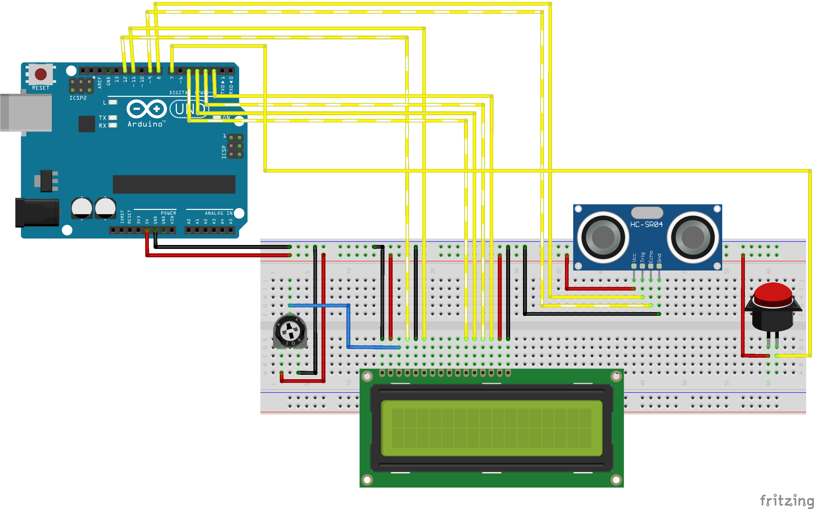

# Ultrasonic Distance Meter

An Arduino-based distance measurement system using an HC-SR04 ultrasonic sensor with real-time display on a 16x2 LCD screen and a pushbutton for triggering measurements.

## Features

- Measures distances in meters, with four decimal places of precision
- Real-time display on 16x2 LCD (when button is pressed)
- Simple, reproducible circuit with common components
- The output is given in the format X.XXXXeX m to represent the distance in scientific notation, where X.XXXX is the measured distance and eX is the exponent.

## Hardware Components

| Component | Quantity | Purpose |
| --- | --- | --- |
| Arduino Uno R3 | 1 | Microcontroller |
| USB Cable | 1 | Power and programming |
| HC-SR04 Ultrasonic Sensor | 1 | Distance measurement |
| 1602 LCD Display | 1 | Output display |
| Breadboard | 1 | Circuit assembly |
| Jumper Wires | ~25 | Connections |
| Male to Female Jumper Wires | 4 | Ultrasonic Sensor connections |
| 10k Ohm Potentiometer | 1 | LCD contrast adjustment |
| Pushbutton | 1 | Trigger distance measurement |
| 220 Ohm Resistor | 1 | Current limiting for LCD backlight |

> Highly recommended to have extra jumper wires, incase they do not reach the breadboard or Arduino. A small breadboard can be used, however this can cause a problem with the LCD display, as it requires a lot of connections. A larger breadboard is recommended.

## Wiring

| Arduino Pin | Component | Component Pin | Function |
| --- | --- | --- | --- |
| 5V | HC-SR04 | VCC | Power |
| GND | HC-SR04 | GND | Ground |
| D7 | Pushbutton | - | Button input |
| D8 | HC-SR04 | Trig | Trigger pulse |
| D9 | HC-SR04 | Echo | Echo return |
| 5V | LCD | VDD | Power |
| GND | LCD | VSS | Ground |
| D12 | LCD | RS | Register select |
| D11 | LCD | Enable | Enable |
| D5 | LCD | D4 | Data bit 4 |
| D4 | LCD | D5 | Data bit 5 |
| D3 | LCD | D6 | Data bit 6 |
| D2 | LCD | D7 | Data bit 7 |

## Circuit Diagram

## Software

### Dependencies

- [Arduino IDE](https://www.arduino.cc/en/software) (2.x or later)
- LiquidCrystal library (included with Arduino IDE)
- math.h library (included with Arduino IDE)

### Installation

1. Download and install the [Arduino IDE](https://www.arduino.cc/en/software)
2. Open [distance_meter.ino](src/distance_meter.ino) in the Arduino IDE
3. Connect your Arduino Uno via USB
4. Select Arduino Uno as the board type
> Newer Arduino IDE versions allow you to select the board from a dropdown menu, and automatically detect the port.
6. Click Upload

### Usage

Once uploaded, the LCD displays the measured distance in meters, updating when the pushbutton is pressed. Point the HC-SR04 sensor at an object to see its distance.

## References

The following resource was used to develop this project, by outlining the basic principles of using an LCD display with Arduino:
https://docs.arduino.cc/learn/electronics/lcd-displays

## License

This project is licensed under the MIT License.